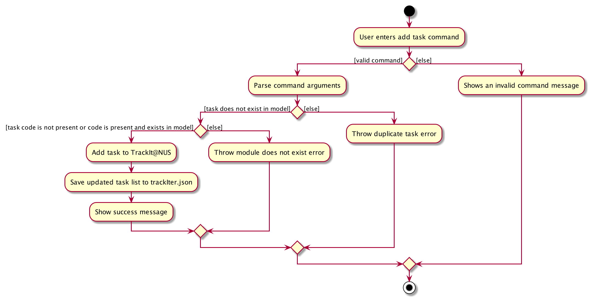
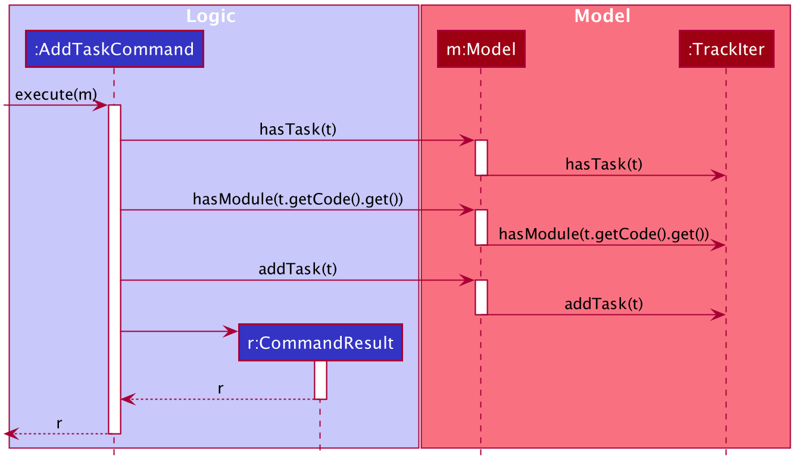
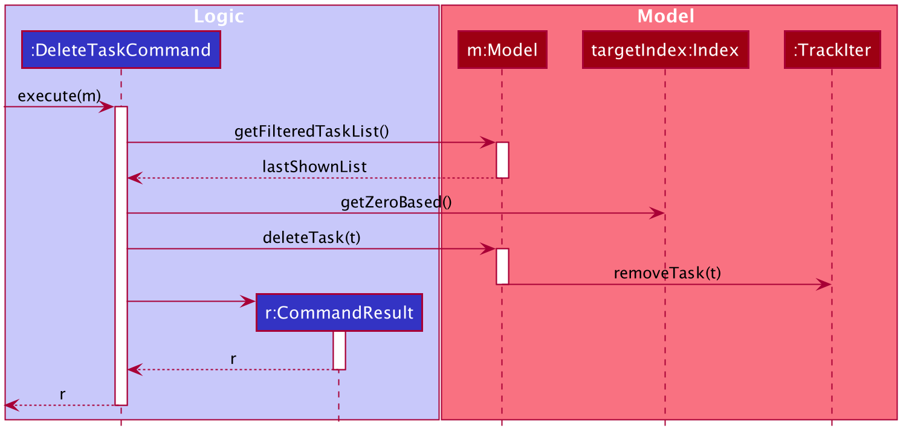

# TrackIt@NUS - Developer Guide

By: `Team W13-4` Since: `Aug 2020` License: `MIT`

## Table of Contents
1. [**Introduction**](#introduction)
2. [**Setting up**](#setup)
3. [**Design**](#design)
    1. [Architecture](#architecture)
    2. [UI Component](#ui)
    3. [Logic Component](#logic)
    4. [Model Component](#model)
    5. [Common Classes](#common)
4. [**Implementation**](#implementation)
    1. [Module Manager](#module-manager)
    2. [Lesson Manager](#lesson-manager)
    3. [Task Manager](#task-manager)
    4. [Contact Manager](#contact-manager)
    5. [Upcoming Tab](#upcoming-tab)
    6. [Logging](#logging)
    7. [Configuration](#config)
5. [**Documentation**](#documentation)
6. [**Testing**](#testing)
7. [**Dev Ops**](#devops) 
[**Appendix A: Product Scope**](#appen-a)  
[**Appendix B: User Stories**](#appen-b)  
[**Appendix C: Use Cases**](#appen-c)  
[**Appendix D: Non-Functional Requirements**](#appen-d)  
[**Appendix E: Glossary**](#appen-e)  
[**Appendix F: Instructions for Manual Testing**](#appen-f)  
[**Appendix G: Effort**](#appen-g)  
--------------------------------------------------------------------------------------------------------------------

## **Introduction** 

**TrackIt@NUS** is a desktop application for managing modules, lessons, tasks, and contacts, tailored to the needs of
 NUS students. It focuses on the _Command Line Interface (CLI)_ while providing users with a simple and clean
  _Graphical User Interface (GUI)_. The main iteraction with **TrackIt@NUS** will be done via commands.
  
**TrackIt@NUS** is an all-in-one solution for busy NUS students. The information that can be managed by **TrackIt@NUS
** includes:

* Modules
* Lessons (for each module)
* Tasks
* Contacts

The purpose of this Developer Guide is to help you understand the design and implementation of **TrackIt@NUS** so
 that you can get started on your contributions to the app.

## **Setting up, getting started** 

Refer to the guide [here](./SettingUp.md).

--------------------------------------------------------------------------------------------------------------------

## **Design** 

In this section, you will learn about the general design and structure TrackIt@NUS. Subsequently, this section will
 also describe and explain how each component in TrackIt@NUS works individually. TrackIt@NUS is coded using the
  [_Object Oriented Programming_](#oop) paradigm and it follows the [_Facade Pattern_](#facade-p) and [_Command
   Pattern_](#command-p) in software design.

### **Architecture** 

### **UI Component** 

### **Logic Component** 

### **Model Component** 

### **Common Classes** 

The `commons` package contains classes used by multiple other components in the `trackitnus.commons` package.

--------------------------------------------------------------------------------------------------------------------

## **Implementation** 

This section describes some noteworthy details on how certain features are implemented.

### **Module Manager** 

### **Lesson Manager** 

### **Task Manager** 

TrackIt@NUS allows users to keep track of his/her tasks. The task manager is one of TrackIt@NUS's basic operations
.
 
 #### Rationale
 
 The task manager is a crucial feature in TrackIt@NUS. Tasks are an integral part of any student's day-to-day life
 . In addition, to better support NUS students, a task can either belong to a module or not. When adding a task, users
  can choose to the include the `m/MODULE_CODE` parameter in order to add a task that belongs to a module. When users
   click into a specific module tab, they can see the tasks belonging to each module.
   

    
:information_source: A task does not have to belong a module. In this case, the module parameter of the task is
 simply treated as null.
     
:warning: The module must exist (i.e. there must be a module with the specified `MODULE_CODE`) otherwise the add
 command will not work.
 
:bulb: To remove a task from a module, simply type `T edit INDEX m/` (use the `m/` prefix but leave the `MODULE_CODE
` parameter empty).

#### Current Implementation
 
In this section, we will outline the key commands of the Task Manager, namely: 
* `AddTaskCommand` 
* `DeleteTaskCommand`
* `EditTaskCommand`

Generally, this is how a Task Manager handles a command.
 
 
                                                                                                            
The following shows the sequence diagram of the `AddTaskCommand`.

The following shows the sequence diagram of the `DeleteTaskCommand`.
 

The follow shows the sequence diagram of the `EditTaskCommand`.

#### Design Considerations

### **Contact Manager** 

### **Upcoming Tab** 

### **Logging** 

### **Configuration** 

--------------------------------------------------------------------------------------------------------------------

## **Documentation** 

Refer to the guide [here](./Documentation.md)

## **Testing** 

Refer to the guide [here](./Testing.md)

## **Dev Ops** 

Refer to the guide [here](./DevOps.md)

--------------------------------------------------------------------------------------------------------------------

## **Appendix A: Product Scope** 

**Target user profile**:

* take multiple modules
* want to easily track their weekly calendar
* want to be notified about important academic dates coming up
* want to have their personal todos & events integrated with their academic calendar
* want to access related contacts when they browse a module
* want to keep track of modules' details (grading scheme, module's knowledge coverage)
* prefer desktop apps over other types
* can type fast
* prefers typing to mouse interactions
* is reasonably comfortable using CLI apps

**Value proposition**
* able to integrate personal todos/events into the weekly academic calendar.
* able to manage modules' information (module's knowledge coverage, grading scheme) & related contacts in one app

## **Appendix B: User stories** 

Priorities: High (must have) - `* * *`, Medium (nice to have) - `* *`, Low (unlikely to have) - `*`

| Priority | As a …​                                    | I want to …​                                                   | So that I can…​                                                        |
| -------- | -------------------- | ---------------------------------------------------------------------- | ---------------------------------------------------------------------- |
| `* * *`  | student              | have all modules' important dates in one place                         | never miss any event                                                   |
| `* * *`  | student              | have information (name, description, time) about any important dates   | always know what to prepare                                            |
| `* * *`  | student              | have all the tutorial/lab details (Zoom link, time) in one place       | easily find them when I need it                                        |
| `* * *`  | forgetful student    | find the grading structure of a module                                 | better revise for each assignment / mid-term / exam                    |
| `* *`    | student              | have all the module descriptions in one place                          | read them if I need to                                                 |
| `*`      | struggling student   | access the contact information of my TA/Prof                           | ask question or schedule a consultation                                |

## **Appendix C: Use cases** 

(For all use cases below, the **System** is the `TrackIt@NUS` application and the **Actor** is the `user`, unless specified otherwise)

**Use case: Find the grading structure of a module**

**MSS**

1.  User requests to list the modules
2.  TrackIt@NUS shows a list of all modules
3.  User requests to find the grading structure of a module in the list
4.  TrackIt@NUS shows the requested grading structure

    Use case ends.

**Extensions**

* 2a. The list is empty.

  Use case ends.

* 3a. The given index (or module name) is invalid.

    * 3a1. TrackIt@NUS shows an error message.

      Use case resumes at step 2.

## **Appendix D: Non-Functional Requirements** 

1.  Should work on any _mainstream OS_ as long as it has Java `11` or above installed.
2.  Should be able to hold up to 1000 tasks/contacts/classes without a noticeable sluggishness in performance for
 typical usage.
3.  Users of the app find the app intuitive and easy to use
4.  A user with above average typing speed for regular English text (i.e. not code, not system admin commands) should
 be able to accomplish most of the tasks faster using commands than using the mouse.
5. The UI of the app is attractive to the users
*{More to be added}*

## **Appendix E: Glossary** 

* **Mainstream OS**: Windows, Linux, Unix, OS-X

* **Obect Oriented Programming** : A type of computer programming paradigm (software design) in which
 programmers define the data type of a data structure, and the types of operations (functions) that can be applied 
 to the data structure

* **Facade Pattern** : A structural design pattern that provides a simplified 
(but limited) interface to a complex system of classes, library or framework.
 While decreasing the overall complexity of the application, it also helps to move unwanted dependencies to one place
 
* **Command Pattern** : A Design Pattern that lets you encapsulate actions within Java
 classes. Of which, each class has an `execute()` method which is declared in the Command interface the class implements

## **Appendix F: Instructions for Manual Testing** 

## **Appendix G: Effort** 
